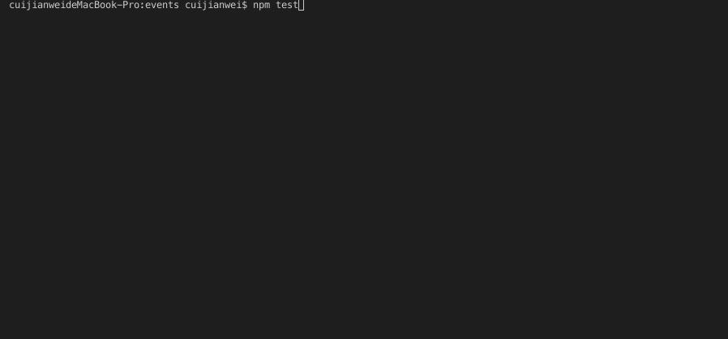

# Javascript 自定义事件代理插件

*****
+ 插件主要特点：
    - 深层嵌套回调函数，以事件模式完全解除了嵌套的问题, 解耦复杂业务逻辑
    - 在不同场景里多个异步同时完成时即执行某个函数，且多个异步执行并行执行 不会堵塞
    - 全局监听事件，订阅模式
    - 兼容node端 浏览器端
*****

## 安装方法
```javascript
    npm install eventsproxy
```
## 测试用例测试结果



## 示例

### 单事件绑定
```javascript
    const createEventsProxy = require('eventsproxy');
    const ep = createEventsProxy();
    fetch(url, options).then(function(response) {
        {`... 复杂业务 ...`}
        ep.emit('Test1', response);
    })
    ep.register('Test1', (data) => {
        {`... 处理data ...`}
    })

```

### 合成事件绑定
```javascript
    // 传统模式
    fetch(url, options).then(function(response) { 
        {`... 复杂业务 ...`}
        fetch(url, options).then(function(response) { 
            {`... 复杂业务 ...`}
            fetch(url, options).then(function(response) { 
                {`... 复杂业务 ...`}
                console.log('finshied');
            })
        })
    })
    
    // EventsProxy 模式
    const createEventsProxy = require('eventsproxy');
    const ep = createEventsProxy();
    fetch(url, options).then(function(response) {
        {`... 复杂业务 ...`}
        ep.emit('Task1', data);
    })
    fetch(url, options).then(function(response) {
        {`... 复杂业务 ...`}
        ep.emit('Task2', data);
    })
    fetch(url, options).then(function(response) {
        {`... 复杂业务 ...`}
        ep.emit('Task3', data);
    })
    ep.register(['Task1', 'Task1', 'Task3'], (data1, data2, data3) => {
        console.log('finshied', data1, data2, data3);
    })
```

### 多事件绑定 
```javascript
    const createEventsProxy = require('eventsproxy');
    const ep = createEventsProxy();
    fetch(url, options).then(function(response) {
        {`... 复杂业务 ...`}
        ep.emit('Test1', data);
    })
    fetch(url, options).then(function(response) {
        {`... 复杂业务 ...`}
        ep.emit('Test2', data);
    })
    ep.register({
        'Test1': (data) => {
            {`... 处理data ...`}
        },
        'Test2': (data) => {
            {`... 处理data ...`}
        },
        'Test1~Test2': (data1, data2) => {
            {`... 处理data ...`}
        }
    })
```

## API文档
``` javascript
    // 引入方式
    const createEventsProxy = require('eventsproxy');
    const ep = createEventsProxy();
    // 注册事件 三种方式
    ep.register('Task', (data) => {
        // 字符串单事件注册
    })
    ep.register(['Task1', 'Task2'], (v1, v2) => {
        // 数组复合事件 回调函数 参数 v1 v2分别是自Task1 Task2传递来的data
    }) 
    ep.register({
        'Task1': (data) => {},
        'Task2': (data) => {},
        'Task1~Task2': (v1, v2) => {
            // 对象批量注册事件 对象事件注册复合事件key的分割线，默认是 ‘~’  
        }
    })
    // 设置对象事件注册复合事件key的分割线，默认是 ‘~’  该注册复合事件的方式只在对象注册事件有效
    ep.setProxyLoopSplit('_');
    // 触发事件
    ep.emit('Task', data)；
```